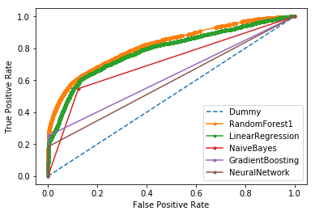

# Applied Machine Learning in Python

All files and my coursework for the coursera course [Applied Machine Learning](https://www.coursera.org/learn/python-machine-learning) with Python by the University of Michigan.

Course completed: August 2020

Here is a link to my [credential](https://www.coursera.org/account/accomplishments/certificate/BW8CR7GXBGQ3). 

## Capstone project
The capstone project was to create a machine learning model for city blight in the US. The goal was to create a model that would predict if a blight violation fine would be paid. 

> The Michigan Data Science Team (MDST) and the Michigan Student Symposium for Interdisciplinary Statistical Sciences (MSSISS) have partnered with the City of Detroit to help solve one of the most pressing problems facing Detroit - blight. Blight violations are issued by the city to individuals who allow their properties to remain in a deteriorated condition. Every year, the city of Detroit issues millions of dollars in fines to residents and every year, many of these fines remain unpaid. Enforcing unpaid blight fines is a costly and tedious process, so the city wants to know: how can we increase blight ticket compliance?
>
> The first step in answering this question is understanding when and why a resident might fail to comply with a blight ticket. This is where predictive modeling comes in. For this assignment, your task is to predict whether a given blight ticket will be paid on time.
>
> All data for this assignment has been provided to us through the Detroit Open Data Portal.
>
> Note: All tickets where the violators were found not responsible are not considered during evaluation. They are included in the training set as an additional source of data for visualization, and to enable unsupervised and semi-supervised approaches. However, they are not included in the test set.

My work for this project can be found in [BlightModel-assignment4.ipynb](BlightModel-assignment4.ipynb). After cleaning the data, I used many different machine learning models to construct predictions for the test data. The following graphic shows the ROC curves for various models. In the end, I chose a RandomTreeGenerator model since it had the best AUC performance.

